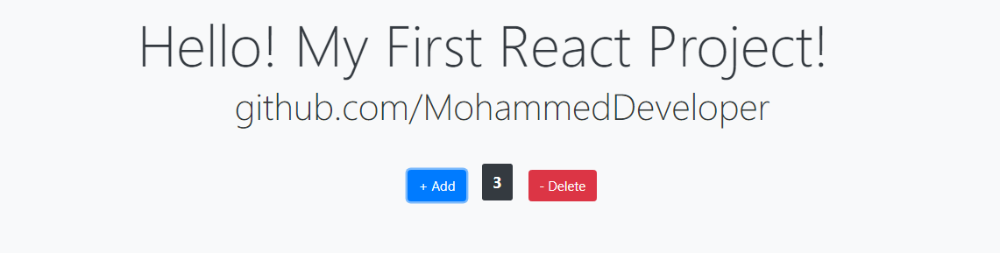

# REACT JS Project - Learn REACT: REFERENCES

Install:
Node | node -v
npm | npm -v
React | npm i -g create-react-app@1.5.2
Editor: VSCode | Add extensions: Simple React Snippets, Prettier

## REACT: Reacts to state changes

- State
- React Element(Virtual DOM) ==> Real DOM

## Create react app: create-react-app my-first-react-app

- Development server (light weight)
- Babel (for compiling JS) ES6
- Webpack
- To run: npm start

## React component:

- ES6 (modern JS code) features like class, extends, import etc...
- render() { return .... }
- ... is JSX: JavasScript XML
- can use React.createElement()
- Babel:

  - Converts the JSX to React HTML code (React.createElement(...))
  - https://babeljs.io/en/repl
  - const element = <h1>Hello</h1> ==> Compiled as below
    var element = React.createElement(
    "h1",
    null,
    "Hello"
    );

- Duplicate object:
  - let copyingObject = Object.assign({}, <objecttocopy>);
  - let copyingObject = ...<objecttocopy>;

## Available Scripts

In the project directory, you can run:

### `npm start`

### `npm test`

### `npm run build`

### `npm run eject`

**Note: this is a one-way operation. Once you `eject`, you can’t go back!**

## Learn More

